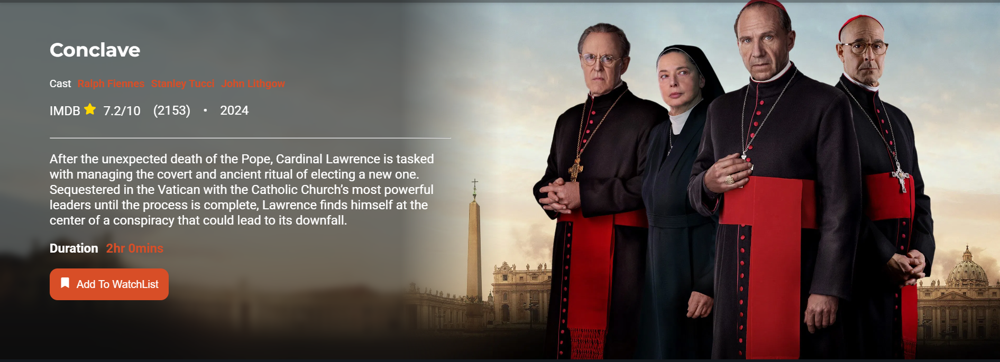

# 📽️Movie Verse

MovieVerse is a web application that allows users to browse popular movies, view information about each movie, create their own watchlist, write reviews and get recommendations on movies to watch based on their interest. Built with mordern web technologies, it offers a clean, responsive and interactive UI.

## Features
- Browse popular movies
- Search for movies by title
- View detailed movie info like synopsis, rating, cast and release date
- curate your own watchlist and get recommendation based on your interests
- Write reviews 

## Tech Stack
- Frontend: React, Javascript, CSS
- Backend: firebase firestore, firebase authentication
- Routing: React Router
- API: TMDb API
- Testing: Playwright
- Deployment: Render, GitHub

## Installation
- git clone https://github.com/woomie/movieVerse.git
- npm install
- create a .env file and add your TMDb API key:
    REACT_APP_TMDB_API_KEY=Your-API-Key-here
- Run the app: npm start
- Run tests: npx playwright test

## Future Plans
- Implement Server-Side Rendering (SSR) with Next.js:
To improve performance, SEO, and load times, I plan to migrate MovieVerse to Next.js and use getServerSideProps to fetch movie data dynamically on the server. This will ensure users get fast, SEO-optimized content and a smoother experience.

- Movie Trailer Previews
Integrate YouTube or TMDB trailer previews directly into movie details 

- Improve User recommendation using AI
Use machine learning or collaborative filtering to generate smarter movie recommendations based on user behavior and preferences.

